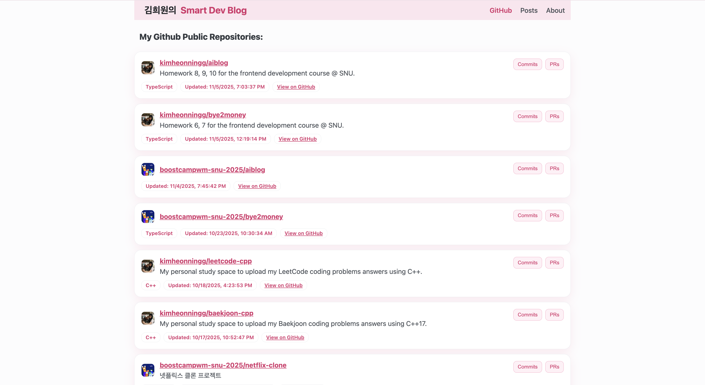
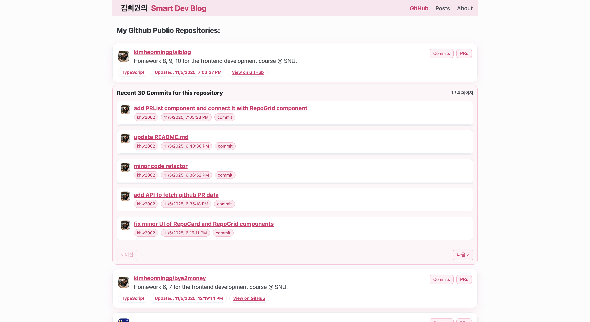
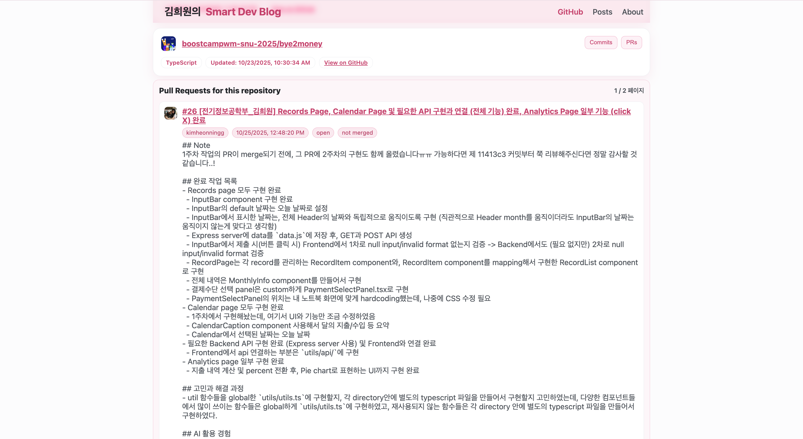

# aiblog

전기정보공학부 김희원 스마트블로그 프로젝트

## Plan

### 1주차

- frontend: vite, backend: express 개발 환경 세팅하기
- frontend/backend directory structure 확립
- Github에서 PR / recent commit 가져오기 (backend)
  - repo list 가져오는 API 생성 (public repo만 가져오기)
  - 선택된 repo에 대해, 그 repo의 commit들 가져오기
- 가져온 PR / recent commit를 보여주기 (frontend)

  - 공통 Header: `Header.tsx`
    - Github 탭: 1주차 용 (내 깃헙의 repo/commit/PR 정보를 보여준다)
    - Posts 탭: 2주차 & 3주차 용 (LLM이 생성한 Blog posts)
    - About 탭: 내 프로필 (2주차 쯤 LLM으로 내용을 생성하여 만들 예정)
  - `.env`: 환경 설정. 내 github token 저장되어 있음 (`.env.example` 참고)
  - `RepoCard.tsx`: card for each public repo
    - 각 `RepoCard` 의 `Commits` 버튼 클릭 시 그 repo의 recent commit 30개 가져와서 보여주도록 (페이지 당 5개씩): `CommitList.tsx`
    - 각 `RepoCard` 의 `PRs` 버튼 클릭 시 그 repo의 내 PR 30개 가져와서 보여주도록 (페이지 당 1개씩): `PRList.tsx`
  - `RepoGrid.tsx`: maps `RepoCard`s and shows all repos

#### 완료 작업 사진

- `Github` tab 클릭 시의 메인 페이지:



- `Commits` button 클릭 시:



- `PRs` button 클릭 시:



### 2주차

- OpenAI API 연동
- Blog contents 자동 생성하도록 OpenAI API 사용

### 3주차

- 생성된 글 저장 및 불러오기 기능

## How to run this project

### Vite Frontend

First set up the `.env` file at frontend root directory `aiblog-fe/`:

```bash
# check .env.example
cp .env.example .env
```

Now run the project:

```bash
# move to the frontend project directory
cd aiblog-fe

# install dependencies if needed
npm install

# run this project
npm run dev
```

This project will open at `http://localhost:5173`

### Express Backend

```bash
# move to the backend project directory
cd aiblog-be

# install dependecies if needed
npm install

# run this project
npm run dev
```

This project will open at `http://localhost:3000`

### Via Script

Or start this project using `start-all.sh`

```bash
# at root directory, run
sh start-all.sh
```

## Directory Structure

### Frontend

- `src/`
  - `constants/`
  - `pages/`
  - `styles/`
  - `types/`
  - `ui/`
  - `utils/`
  - `main.tsx`

### Backend

- `routes/`
- `controllers/`
- `services/`
- `repositories/`
- `models/`
- `utils/`
- `data/`

## API Endpoints

### Test API

Test API to check if the server is running.

```plaintext
GET /test/version
```

### Github Data API

API to fetch data from my Github.

#### My Repos

API to fetch my public repo data from my Github.

```plaintext
GET /github-data/my-repos
```

- Headers:

```plaintext
Authorization: Bearer ghp_YOUR_TOKEN
Content-Type: application/json
```

#### Recent Commits

API to fetch recent commit data from a specific Github repository.

```plaintext
GET /github-data/recent-commits
```

- Headers:

```plaintext
Authorization: Bearer ghp_YOUR_TOKEN
Content-Type: application/json
```

- Query Parameters:
  - `repo` (string): `kimheonningg/REPO_NAME`
  - `since` (string (ISO 8601), optional): `2025-11-01T00:00:00Z`
  - `until` (string (ISO 8601), optional): `2025-11-02T00:00:00Z`
  - `per_page` (number, number of commits to fetch, optional): `20`
  - `page` (number, page number to fetch, optional): `1`

#### My Pull Requests

API to fetch my pull request data from a specific Github repository.

```plaintext
GET /github-data/my-pull-requests
```

- Headers:

```plaintext
Authorization: Bearer ghp_YOUR_TOKEN
Content-Type: application/json
```

- Query Parameters:
  - `repo` (string): `boostcampwm-snu-2025/REPO_NAME`
  - `state` (string, PR filter by PR state, optional): `open` / `closed` / `all`
  - `per_page` (number, number of PRs to fetch, optional): `20`
  - `page` (number, page number to fetch, optional): `1`
